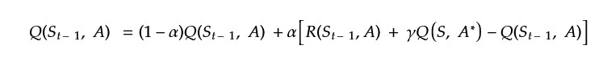

# Computational Intelligence Project: Hanabi Game
The initial idea was to build a collaborative collaborative Multi-agent Reinforcement Q-learning framework for the Hanabi game.
This game can be modeled as a Partially Observable Markov Decision Problem(PO-MDP). So I want to build a model capable of learning in a collaborative way the best joint action to maximize the Game score.

I shrunk down the problem into an easier version. 

## The Basic IDEA

Each Agent observes his environment and keeps track of: 
- His actions;
- Other player's action;
- The state of the table his card and other players' cards.

An agent, in order to pass from state A to state B, needs to know the list of all actions that all players make because their transition from state A to state B does not depend on the single action of the player who does it.
Each time a player makes an action each agent observes that action and assigns a reward. The sum of all rewards of all actions gives a total reward that will be put in the reward Table.

Then we have to update the Q-table to learn what future action will be the best from the current state.
In order to do that, I use the bellman equation for Q-learning but here I encounter a problem.

In order to perform the update I need the best Q-value from the next state but, at time T I don't have access to the next state because I don't know what it could be. I need to discover it first.
The next idea was to perform the update at posteriori. To do that I keep track of the past State and when I will be in the next state I perform the update. So the Formula became:

## The Big Space of States
The difficulty of the game is to model his big space of game states.
An idea was to evaluate the states in a way that all similar states can have similar signatures. So when I had explored enough of the state space I could compute the distance between my state and the already known states and substitute the last founded state with an already discovered one.

To solve this problem the state evaluation is divided into three parts:
- We have 3 numbers for the table part:
  - number of blue tokens;
  - number of red tokens;
  - score of the table at the time of evaluation;
- One number for each player hand in the game:
  - Each player is evaluated not using the cards that it has in his hand at evaluation time but the score that he can perform if plays all his card
- One number to evaluate my hand:
  - Is evaluated based on a statistical version of my hand and then a score is computed in the same way as the other players
